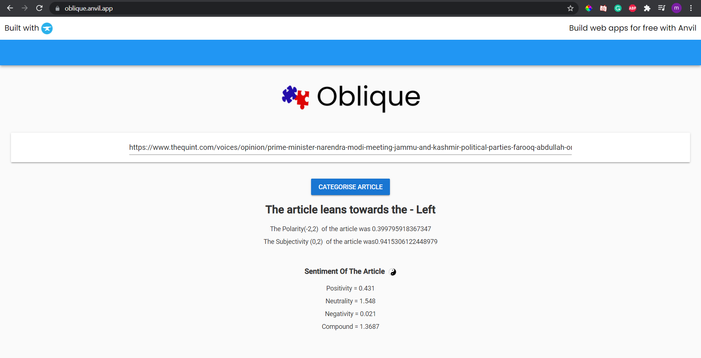

# News-Bias-Classifier
NLP and Ensemble machine learning to classify bias

### We scraped self proclaimed Left and right wing News websites with the help of New_Scraper script and then applied NLP and passed the data through random forest for supervised machine learning to classify the news achieving an accuracy of 72%

### hosted on anvil.works, and google collab as the backend, the anvil.py and oblique_anvil.pynb are used with the pickled model imported from google drive

